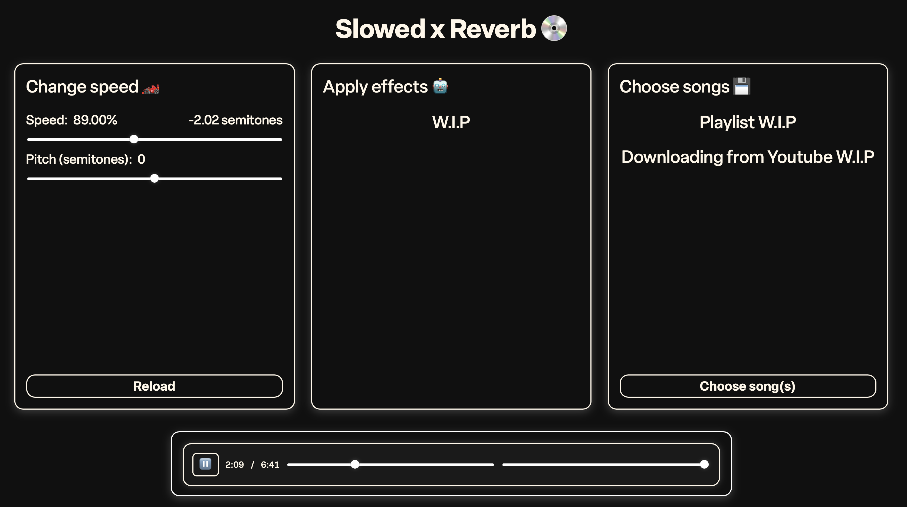

<h1>Slowed Reverb Site</h1>
Change speed and pitch of your favourite songs in browser. Also apply effects, such as <b>Reverb</b> (In the future...).

<h2>To start</h2>
<ol>
  <li>Install ffmpeg
    <ul>
      <li><b>Mac OS:</b> brew install ffmpeg</li>
      <li><b>Windows:</b> choco install ffmpeg</li>
      <li><b>Debian/Ubuntu:</b> sudo apt install ffmpeg</li>
      <li><b>Arch:</b> pacman -S ffmpeg</li>
    </ul>
  </li>
  <li>Run: <b>pip install -r requirements.txt</b></li>
  <li>Run <b>"python manage.py runserver"</b> after you finish installing the necessary libraries</li>
  <li>Press <b>ctrl + c</b> to kill server</li>
</ol>
