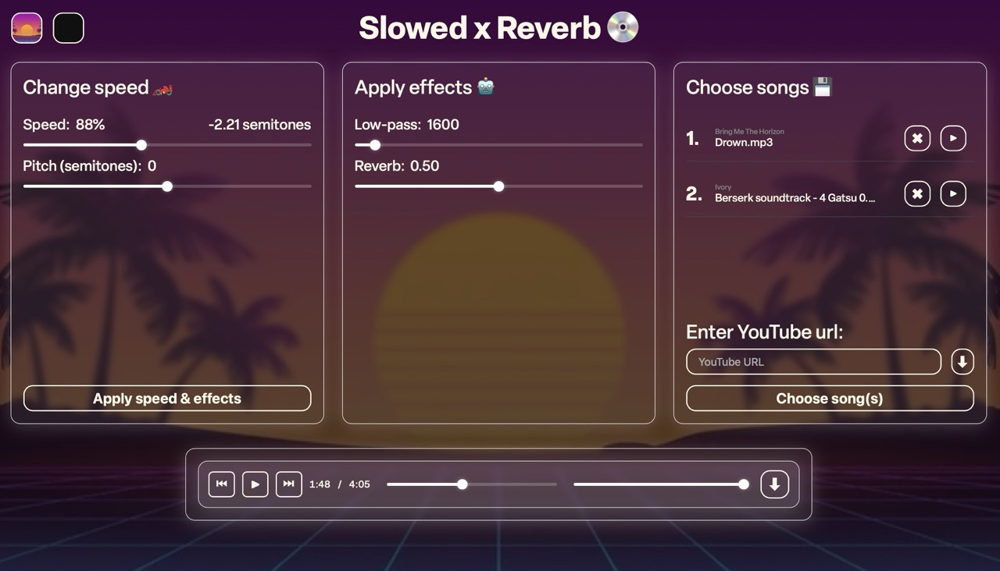

<h1>Slowed Reverb Site</h1>
Change speed and pitch of your favourite songs in browser. Also apply effects, such as <b>Reverb</b> (In the future...).

<h2>To start</h2>
<ol>
  <li>Install ffmpeg
    <ul>
      <li><b>Mac OS:</b> brew install ffmpeg</li>
      <li><b>Windows:</b> choco install ffmpeg</li>
      <li><b>Debian/Ubuntu:</b> sudo apt install ffmpeg</li>
      <li><b>Arch:</b> pacman -S ffmpeg</li>
    </ul>
  </li>
  <li>Install <a href="https://docs.astral.sh/uv/">uv</a></li>
  <li>Run: <b>uv sync</b> to install dependencies into a virtual environment</li>
  <li>Run <b>"uv run python manage.py runserver"</b> to start the server</li>
  <li>Press <b>ctrl + c</b> to kill server</li>
</ol>

<h2>Development</h2>
<ul>
  <li>Lint: <b>uv run ruff check .</b> (auto-fix with <b>uv run ruff check --fix .</b>)</li>
  <li>Format: <b>uv run ruff format .</b></li>
  <li>Type check: <b>uv run mypy .</b></li>
</ul>

<h2>Known issues:</h2>
<bl>
  <li>YouTube downloading: sadly, it works bad on Windows specifically. Deleting lines 237-240 in views.py helped me. </li>
</bl>

