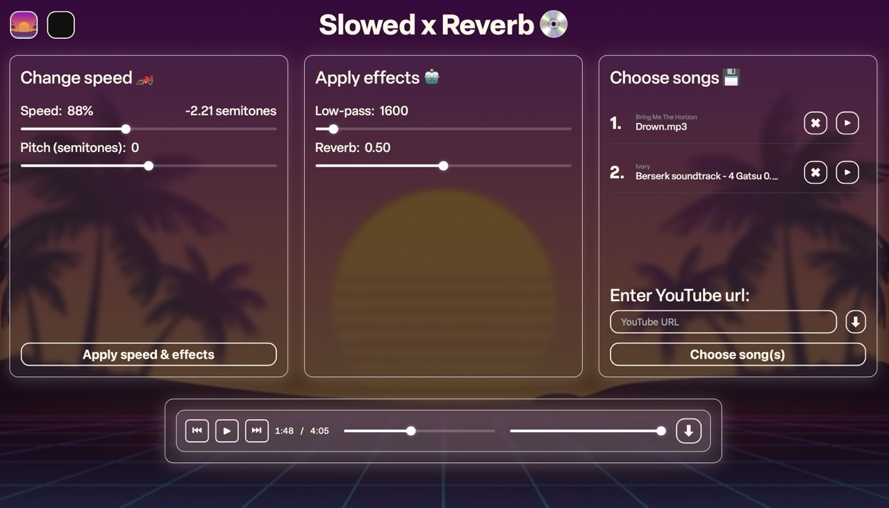

# Slowed Reverb Site



Change the speed and pitch of audio in your browser. The application combines a
Django API with a SvelteKit frontend and includes the foundations for effects
such as reverb.

## Listening workspace

Choose **Original**, **Slowed**, **Dream**, or **Afterhours** to set the speed,
reverb, tone, and output together. Adjust any control to customize the sound;
**Reset** returns every effect to the original audio settings.

Effect settings, appearance, and the keyboard-shortcut preference are saved in
this browser when local storage is available. Audio data is not saved in local
storage; the queue still belongs to the server session. Blocked or corrupt
browser storage does not prevent playback.

Open **Keyboard shortcuts** below the workspace, or press `?`, for the guide:

| Key | Action |
| --- | --- |
| Space | Play / pause |
| Escape | Stop and rewind |
| Left / right arrow | Seek five source seconds |
| Shift + left / right arrow | Previous / next track |
| R | Toggle repeat |

Shortcuts leave fields, buttons, links, sliders, and open dialogs alone. Browser
modifier shortcuts are preserved. All workspace shortcuts can be disabled in
the guide.

## Run with Docker

Docker is the quickest way to run the complete application. The image builds
the SvelteKit frontend and serves it with the Django API through Gunicorn and
WhiteNoise. FFmpeg is included in the image.

```sh
docker compose up --build
```

Open <http://localhost:8080>. Press `Ctrl+C` to stop the application.

The SQLite database and processed audio persist in the `app-data` Docker
volume. For a production deployment, set `DJANGO_SECRET_KEY` and
`DJANGO_ALLOWED_HOSTS`; the available settings are documented in
[`compose.yaml`](compose.yaml).

## Local development

### Prerequisites

- Python 3.13 or later
- [uv](https://docs.astral.sh/uv/)
- Node.js 20 or later
- FFmpeg

Install FFmpeg with the package manager for your platform:

```sh
# macOS
brew install ffmpeg

# Debian or Ubuntu
sudo apt install ffmpeg

# Windows (Chocolatey)
choco install ffmpeg

# Arch Linux
sudo pacman -S ffmpeg
```

Install the backend and frontend dependencies:

```sh
uv sync
npm --prefix frontend ci
```

Start Django and Vite in separate terminals:

```sh
uv run python manage.py migrate
uv run python manage.py runserver
```

```sh
npm --prefix frontend run dev
```

Open <http://localhost:5173>. Vite proxies API requests to Django on port
`8000`.

## Quality checks

```sh
uv run ruff check .
uv run ruff format --check .
uv run mypy .
uv run python manage.py test
npm --prefix frontend run check
npm --prefix frontend test
npm --prefix frontend run build
npm --prefix frontend audit
```

To apply Python formatting, run `uv run ruff format .`. Ruff can automatically
fix supported lint violations with `uv run ruff check --fix .`.

GitHub Actions checks the frontend on Node 20 and 24 using the committed lockfile.
The toolchain uses patched SvelteKit, Svelte, Vite, and Vitest releases. The scoped
`cookie` override keeps SvelteKit's compatible cookie API on a patched release
until its upstream dependency range includes it.

## Known issues

YouTube downloads may be less reliable on Windows because of differences in
the local `yt-dlp` and FFmpeg environment.
